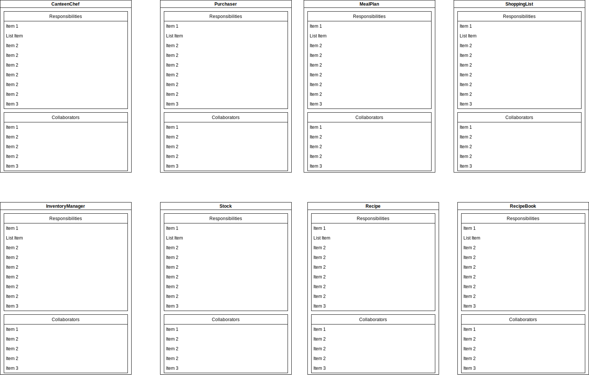

# Stories and Model

- [Stories and Model](#stories-and-model)
  - [Stories](#stories)
    - [Planning Meals](#planning-meals)
    - [Updating the recipe book](#updating-the-recipe-book)
    - [Send someone shopping](#send-someone-shopping)
    - [Taking Stock](#taking-stock)
    - [Managing Leftovers](#managing-leftovers)
  - [CRC Card Model](#crc-card-model)

## Stories

### Planning Meals

The Canteen Chef sits down and plans the meals for a week. They search in their recipe book for meals they want to cook in that week, taking into account that they want to focus on providing a healthy diet to their guests.
They also want to take into account the effort that goes into preparing and cooking a meal given the time they can dedicate to it each day.
Another consideration for them is how meals fit together, e.g. if they plan for potatoes as a side for Monday, they want to use leftovers later that week.
They will also ask the inventory manager if there are any items on stock that need to be used by a certain day in that week and if so, plan a meal to use these items by that date.
They will also aks the inventory manager if any of the meals in the recipe book are available in the freezer. If so, the effort for preparing that meal drops accordingly and they can plan that meal for any day regardless of available time.
They write down their decision on a plan and hang it on the kitchen wall.

### Updating the recipe book

The canteen chef takes a recipe from the recipe book and updates it. A recipe consists of

- a name for the meal,
- the effort it takes to prepare,
- how healthy it is, which the chef derives from the
- ingredients used
- how the meal is prepared

Each of those contents the chef may want to change.

The chef will also create new recipes in the book or remove recipes they no longer use.

### Send someone shopping

The Purchaser looks at the meal plan and takes out the recipe book. They extract the necessary ingredients needed for the weeks meals and put them on a list. They give the list to the inventory manager who removes items from the list which are in stock. The purchaser then plans a shopping list. Ingredients need to be bought before they are needed but not so early that they don't keep until needed, so Friday's salad is not to be bought before Wednesday. Ideally, there should only be one major shopping trip a week. A major shopping trip is a shopping trip where

- more than one shop is visited or
- more than 5 items are bought

Once the shopping list has been planned, it is stuck on the kitchen wall next to the meal plan.

### Taking Stock

When a shopping trip has been completed, the inventory manager updates their records of goods at hand. When a meal is cooked, they do likewise. When certain ingredients which are used universally, like salt, sugar, flour, spices, oil, mustard, vinegar, tomato paste,... or marked as 'have on stock' like canned tomatoes, canned or dried legumes, frozen vegetables,... fall under the desired stock level, they ask the Purchaser to put the items on the list for the next major shopping trip.

### Managing Leftovers

Leftovers from meals are either kept in the freezer or kept in the fridge. The Inventory Manager has knowledge about items in the freezer and the fridge. They notify the canteen chef about leftovers in the fridge that need to be eaten. The chef then updates the meal plan accordingly together with the purchaser and inventory manager to make sure that no goods bought for a meal which is now to be dropped from the list will go to waste.

## CRC Card Model

